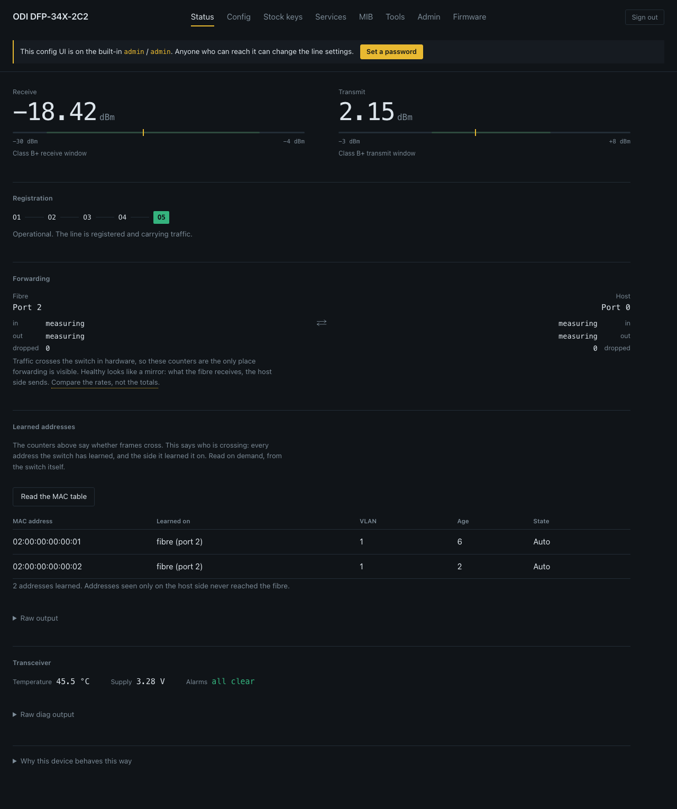
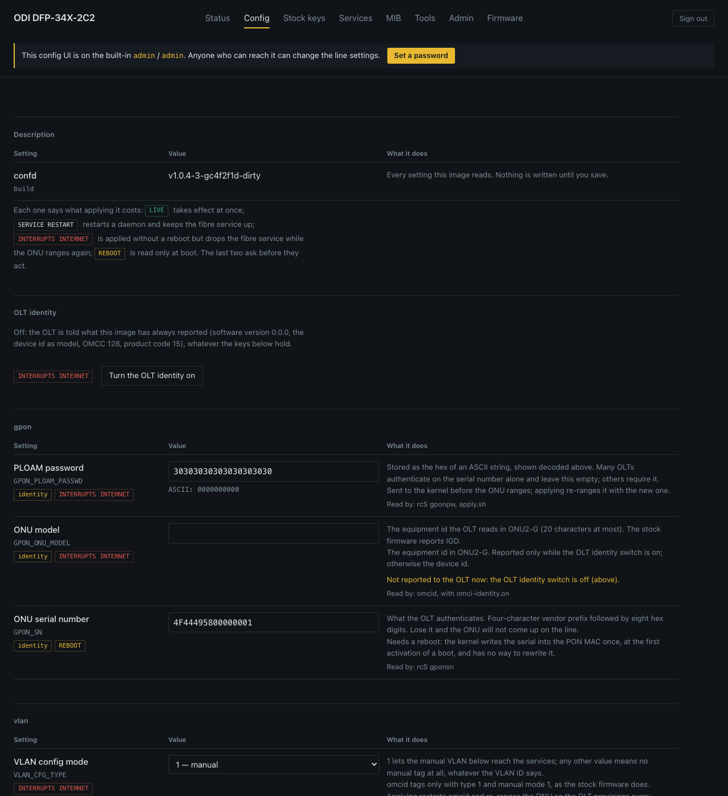
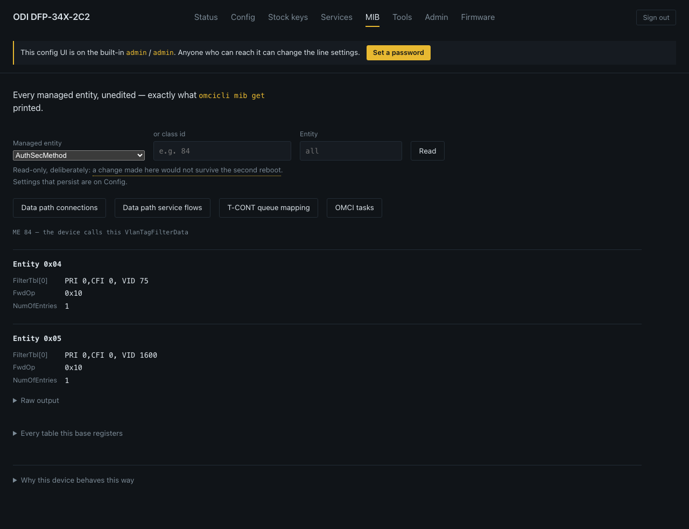
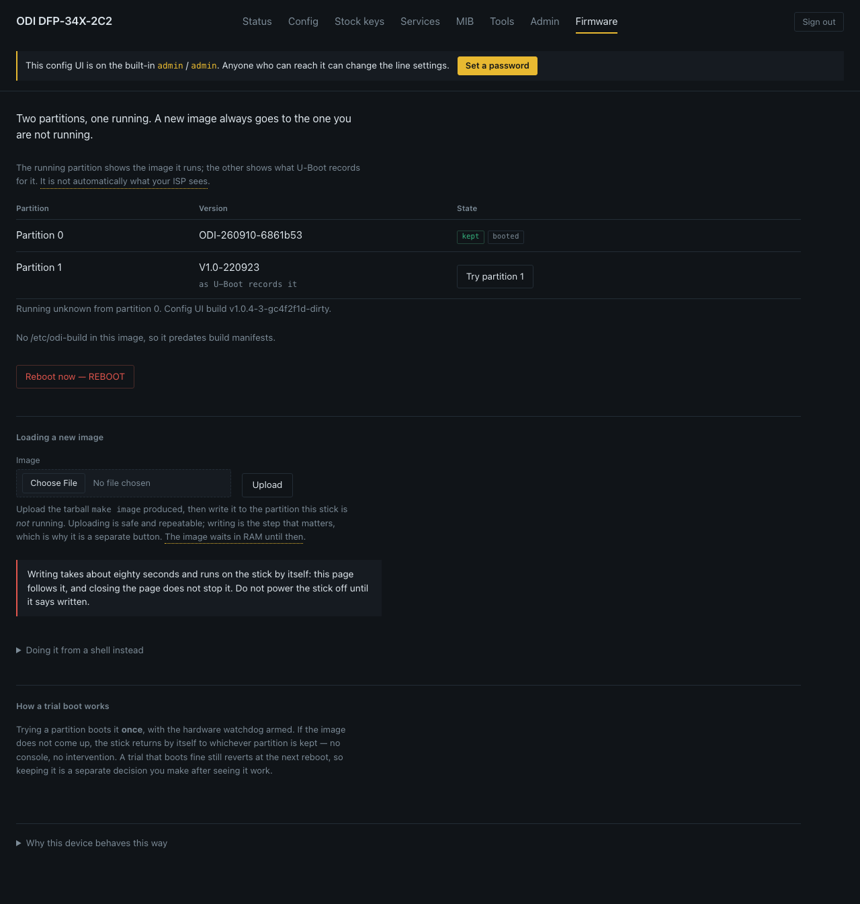
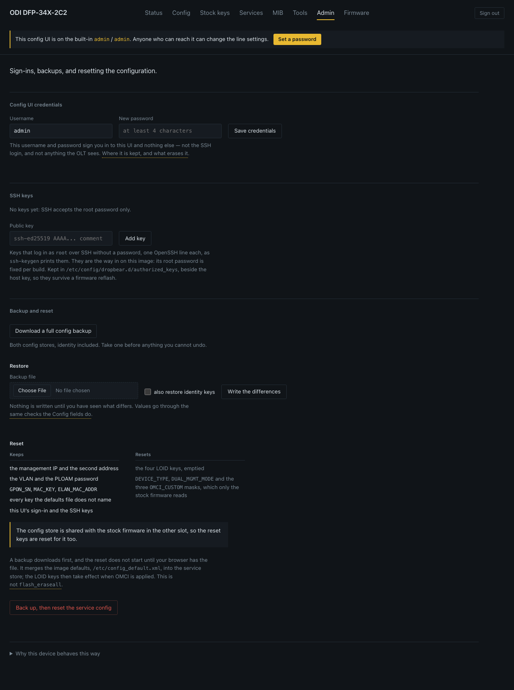
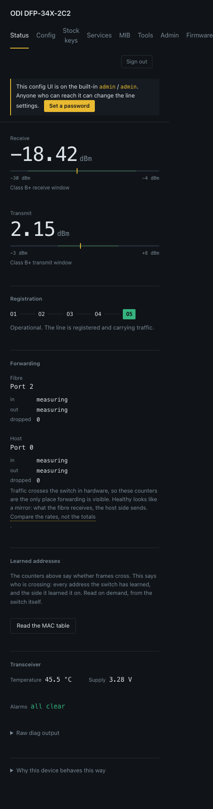

# odi-ui

A web configuration UI for the **ODI DFP-34X-2C2** GPON SFP ONU stick
(Realtek RTL9601D, RLX5281, big-endian MIPS). It builds `confd`: a small,
freestanding daemon plus a static JS/HTML page, driven by a data-driven schema
rather than hand-written handlers, so adding a configuration key is a data
change, not a new C handler or a reflash.

Part of [odi-oss](https://github.com/AndreZiviani/odi-oss), the open firmware
project for this stick.

## What it does

- **Status** — optics, ONU state, alarms, switch-port counters, learned MAC
  addresses.
- **Config / Stock keys** — every configuration key, schema-driven forms,
  labelled with what applying a change costs.
- **Services / MIB** — what the OLT actually provisioned, and the raw OMCI
  MIB underneath it.
- **Tools** — kernel log, ping.
- **Firmware** — both partitions, image upload and write, one-shot trial boot.
- **Admin** — UI credential, SSH keys, backup, restore, reset.

On the **stock/OEM firmware**, `confd` runs alongside the vendor's `boa`, on
its own port — it does not replace it. On the **odi-oss image**, `boa` is
gone entirely and `confd` replaces it, serving on port 80.

See [`docs/DESIGN.md`](docs/DESIGN.md) for why it is built this way (schema
generation, MIB vs config semantics, the OMCI feature bitmasks, firmware trial
boot, authentication model, and more) and [`docs/API.md`](docs/API.md) for the
HTTP API reference.

## Screenshots

From the qemu preview (`scripts/preview.sh`) with recorded fixtures; identifiers are placeholders.

| Status | Config |
|---|---|
|  |  |
| **MIB browser** | **Firmware** |
|  |  |
| **SSH keys** | **Phone width** |
|  |  |

## Getting it

Either download `confd`, `confd-assets.tar.gz` and `SHA256SUMS` from a
[release](../../releases), or flash an odi-oss image built by
[`odi-sandbox`](https://github.com/AndreZiviani/odi-sandbox), which already
bakes both in and starts the daemon at boot.

## Building and testing

Everything builds in a container — Docker and `make` are all the host needs,
no login or token required:

```sh
make            # confd, verify (ELF shape + ISA audit), check, smoke
make release    # everything CI does, including the release assets
```

See [`docs/BUILDING.md`](docs/BUILDING.md) for the toolchain image, deploying
to a stick, and every test in detail.

## License

GPL-2.0-or-later. See [`LICENSE`](LICENSE).

## Related

- [odi-oss](https://github.com/AndreZiviani/odi-oss) — the parent project
- `~/git/odi-sandbox` — the firmware image, provisioning runbooks, line profiles
- `odi-sfp-exporter` — the Prometheus exporter and the freestanding runtime
